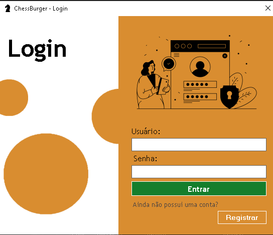
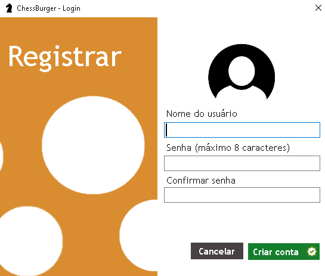
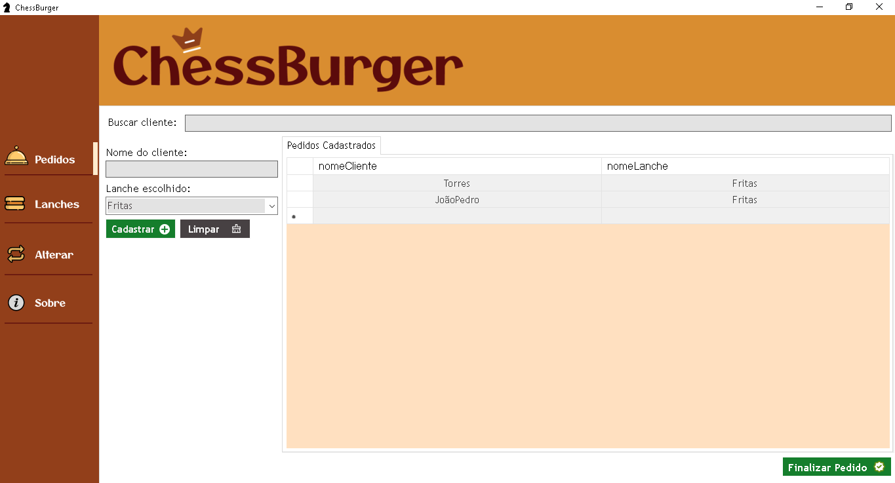
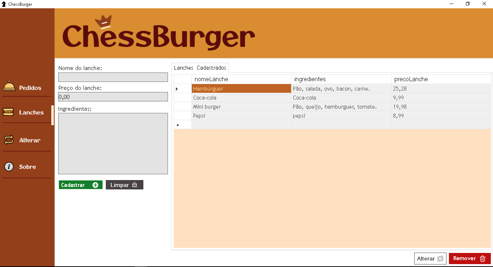
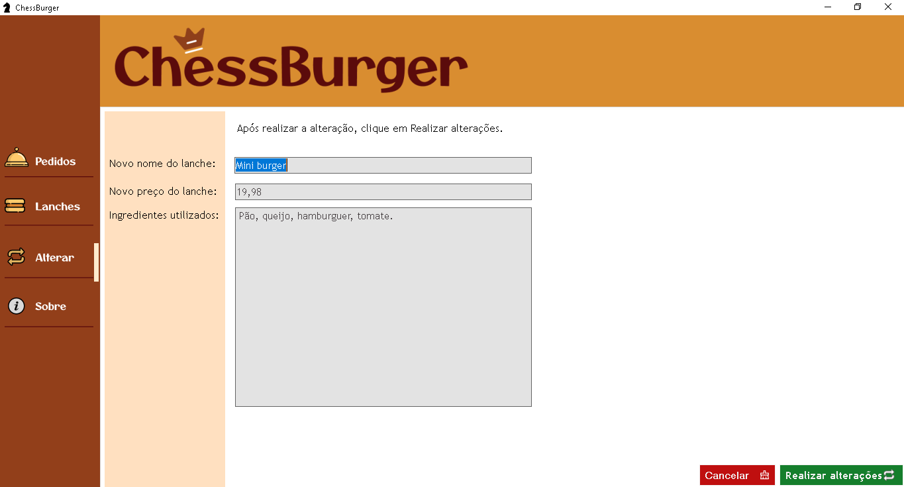

# ChessBurger

> Gestor de pedidos para hamburgueria ChessBurger

### Tela de login 

### Tela de registro

### Tela dos Pedidos

### Tela dos lanches

### Tela de alteração

### O que há nessa versão?

O projeto atualmente é funcional, permite que você cadastre clientes e lanches.

- [x] Cadastro de pedidos
- [X] Cadastro de lanches
- [X] Interface funcional
- [X] Remoção de lanches
- [X] Finalização de pedidos

## 💻 Pré-requisitos

Antes de começar, verifique se você atendeu aos seguintes requisitos:

- Você instalou a versão mais recente do VisualStudio,
- Você tem uma máquina Windows.

## 🤝 Desenvolvedores

Agradecemos às seguintes pessoas que contribuíram para este projeto:

<table>
  <tr>
    <td align="center">
      <a href="#" title="Perfil do Línicker Mota no GitHub">
         
        
          <b>Línicker Mota</b>
        
      </a>
    </td>
    <td align="center">
      <a href="#" title="Perfil do Yago Mello no GitHub">
         
        
          <b>Yago Mello</b>
        
      </a>
    </td>
  </tr>
</table>
